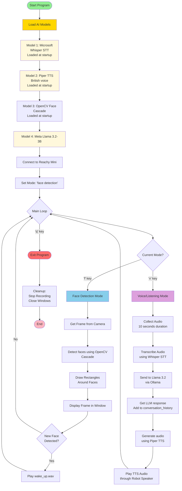

# reachy-project
- [reachy-project](#reachy-project)
  - [Working with AI models](#working-with-ai-models)
  - [Design](#design)
  - [Getting the Reachy Mini to look at a point in a frame](#getting-the-reachy-mini-to-look-at-a-point-in-a-frame)
  - [Detect face and play sound](#detect-face-and-play-sound)
  - [Installing Ollama and running models](#installing-ollama-and-running-models)
  - [Text-to-speech](#text-to-speech)
  - [Useful commands](#useful-commands)
  - [References](#references)

The final version of my code is here [face_detection_and_chat.py](face_detection_and_chat.py). 

It took a lot of experimentation to get to, all of which is now in the [starter-code](./starter-code) directory. I talk about some of it in the sections below.


If you want to follow the plan of action and timeline for my project, go to [plan-timeline.md](plan-timeline.md). 

## Working with AI models
This was my first time coding and working with AI. It took quite a lot of work to get here, and I still have a long way to go. However, I'm very happy I was able to get my Reachy Mini (whose name is Cleo) to have basic conversations!

To get my final code working, I needed:
- sample code that showed me how to work with the Reachy Mini for audio and video, which is referenced in comments in my code
- a library to recognise faces `cv2`
- a way to download and run AI models that my Python application can use `ollama`
- a model to convert speech to text `Whisper STT`
- an AI model to process the text: Meta's `Llama 3.2-3B` or Microsoft's `Phi:3 Mini` (I used `Llama 3.2` in the end because it gave shorter responses)
- a model to convert the response text to speech `Orpheus TTS` or `Piper TTS` (`Piper TTS` was simpler, so I used it)


## Design


**Keyboard Controls:**
- `f` = Switch to Face mode
- `v` = Switch to Voice mode  
- `x` = Clear conversation history
- `q` = Quit program
```

## Getting the first sample program running
First of all, install the [Reachy Mini Control App](https://github.com/pollen-robotics/reachy-mini-desktop-app)

I kept the Reachy Mini Control App running in the background and turned the robot on. It was connected to my mac using a USBC cable. I already had `uv` installed in my terminal. To activate the reachy environment, I wrote:

```sh
source reachy_mini_env/bin/activate
```

and got this response: 

```sh
Kyra@mac reachy-project % source reachy_mini_env/bin/activate
(reachy_mini_env) Kyra@mac reachy-project % 
```

I got the sample program from here https://github.com/pollen-robotics/reachy_mini/blob/develop/docs/SDK/quickstart.md and ran the following command because I needed the `reachy_mini` library:

```sh
uv pip install "reachy-mini"
```

I ran the python command in the terminal. This is the response I got:

```sh
(reachy_mini_env) Kyra@mac reachy-project % python antenna-wiggle.py
Connected to Reachy Mini! 
Wiggling antennas...
Done!
``` 

## Getting the Reachy Mini to look at a point in a frame

Make sure your environment is active:
```sh
source reachy_mini_env/bin/activate
```

To run the python script, use the command below:

```sh
(reachy_mini_env) Kyra@mac reachy-project % python look-at-point-in-image.py   
Click on the image to make ReachyMini look at that point.
Press 'q' to quit the camera feed.
Exiting...
```

This will open a new window on your laptop showing a live image of what the robot camera sees. Note that most of the code in this program ([look-at-point-in-image.py](look-at-point-in-image.py)) is partly from an example and not written by me.


## Detect face and play sound

This program [face_detection.py](face_detection.py) recognises and draws rectangles around faces. When a new face is detected, the Reachy Mini will play a sound.


## Installing Ollama and running models

To install ollama, I ran the following command:
```sh
brew install ollama

brew services start ollama
```

Now, to pull and run the phi3 model from Microsoft, use the following compands:
```sh
ollama pull phi3:mini

ollama run phi3:mini
```


Once the AI model was running, this is how I said hello to the phi3:mini and its response:
```sh
Kyra@mac ~ % ollama run phi3:mini      
⠸ >>> hello!
Hello there! How can I assist you today?
```

## Text-to-speech

For this project, I am using Piper TTS model. To download Piper and voice packages, run:

```sh
uv pip install piper-tts   

python -m piper.download_voices en_GB-southern_english_female-low
```

Then, all you have to do is run ([piper_test.py](piper_test.py))


## Useful commands

There were a lot of python files, so I moved the old ones to ([starter-code](starter-code)). This is the command I used, taking ([antenna-wiggle.py](antenna-wiggle.py)) as an example:
```sh
git mv antenna-wiggle.py starter-code/
```

## References

- Official Standard Development Kit (SDK): https://github.com/pollen-robotics/reachy_mini?tab=readme-ov-file
- Python SDK documentation: https://github.com/pollen-robotics/reachy_mini/blob/50923d19d12c13a66baff86cf29ac088d90b07db/docs/SDK/python-sdk.md
- https://github.com/pollen-robotics/reachy_mini_conversation_app
- Mirror test: https://youtu.be/gw2DShGlreQ?si=pziOKiugGwmuNSxI
- https://realpython.com/defining-your-own-python-function/
- https://github.com/dwain-barnes/reachy_mini_conversation_app_local
- https://github.com/pollen-robotics/reachy_mini/blob/develop/examples/debug/sound_play.py
- Ollama Python documentation: https://github.com/ollama/ollama-python
- Open AI Whisper models to choose from: https://github.com/openai/whisper?tab=readme-ov-file#available-models-and-languages
- Llama model I'm using: https://www.llama.com/docs/model-cards-and-prompt-formats/llama3_2/
